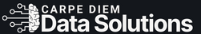
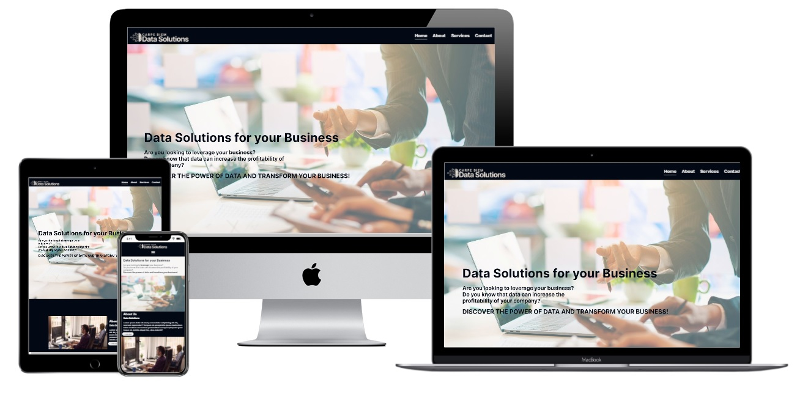
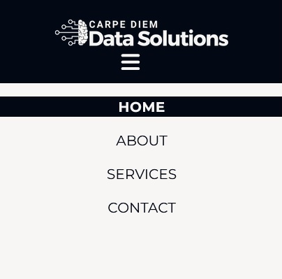
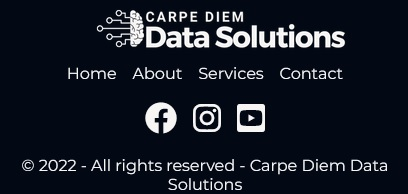

# **_Carpe Diem Data Solutions - Project Portfolio 1 - HTML & CSS_**

 

Carpe Diem Data Solutions is a small business consulting company that offers data analysis, data science and data engineering services. Our target audience through this website
 are small and medium -sized companies that want to improve their performance, profitability and customer services through their data.

Welcome to the live site here: <a href="https://fmstacco.github.io/Carpe-Diem-Data-Solutions/index.html" target="_blank">Carpe Diem Data Solutions</a>

# Contents

* [**Objective**](<#objective>)
* [**User Experience UX**](<#user-experience-ux>)
    * [Target Audience](<#target-audience>)
    * [User Stories](<#user-stories>)
    * [Site Aims](<#site-aims>)
    * [Wireframes](<#wireframes>)
    * [Site Structure](<#site-structure>)
    * [Design Choices](<#design-choices>)
    *  [Typography](<#typography>)
    *  [Colour Scheme](<#colour-scheme>)
* [**Features**](<#features>)
    * [Navigation Menu](<#navigation-menu>)
    * [Home Page](<#home-page>)
    * [About Page](<#about-page>)
    * [Services Page](<#services-page>)
    * [Contact Page](<#contact-page>)
    * [Thank You Page](<#thank-you-page>)
    * [Footer](<#footer>)
* [**Future Features**](<#future-features>)
* [**Technologies Used**](<#technologies-used>)
* [**Testing**](<#testing>)
* [**Deployment**](<#deployment>)
* [**Credits**](<#credits>)
    * [**Content**](<#content>)
    * [**Media**](<#media>)
*  [**Acknowledgements**](<#acknowledgements>)

# Objective 

This project aims to deliver a professional website of a business consultancy focused on data analysis and data science, so that potential customers - small and medium -sized companies - know the services offered and the benefits they will have through them.

# User Experience (UX)

## Target Audience

* Users (potential customers) who are looking for data analysis and data science services to leverage their business.
* Users (potential customers) who want to implement a data strategy in their business to increase profitability and improve customer services.

## User Stories

* As a potential customer, I want to easily navigate through their website pages so I can quickly get the information that I’m looking for.[navigation bars and buttons].
* As a potential customer, I want to see what the results my company can achieve after contracting their services. [benefits].
* As a potential customer, I want to see the people who are the people doing the job and its credentials, it would increase my confidence towards getting in touch and hiring them. [about us page]
* As a potential customer, I want to know what services the company offers so I can quickly understand if they can address my business issues. [services page]
* As a potential customer, I want to see how the company has helped other clients it helps me to see how competent they are doing their job. [testimonial]
* As a potential customer, I want to know that they will get in touch quickly for a discussion on my business and how can they help me. [thank you page]
* As a potential customer, I want to see what tools they use when offering their services so I can trust they know what they are doing. [tools]

[Back to top](<#contents>)

## Site Aims

* To establish an online presence through a website and not just rely on social networks as Facebook, Instagram.
* Be easily found by potential customers through search engines.
* To offer information about the company and its services as well as data analysis and data science.

## Wireframes

The wireframes for Carpe Diem Data Solutions website were produced on [Balsamiq](https://balsamiq.com).  

 

[Back to top](<#contents>)

## Site Structure

Carpe Diem Data Solutions website has four pages. The [home page](index.html) is the default loading page, [about](about.html), [services](services.html.html) and [contact](contact.html) pages are all accessible from the navigation menu and from the footer menu. 

[Back to top](<#contents>)

## Design Choices

 * ### Typography
  

 * ### Colour Scheme

# Features

## Navigation Menu

*In the header of all the page of the site there is the logo and the navigation menu.

*When clicking on the logo the user is directed to the Home page.

*To improve the user experience there is the hover effect on menu items, which changes the background and font colors.

*The header is responsive with the Hamburger menu made only with HTML and CSS inspired by Dev Reis Chanel https://www.youtube.com/watch?v=cfmmnuxz3y

Please click on the links below to see the images of the navigation menu:

<b>Navigation Menu - Image Desktop</b>

<b>Navigation Menu - Image Mobile</b>

## Home Page

## About Page

## Services Page

## Contact Page

## Thank You Page

## Footer

* The footer section contains the company logo, which takes the potential customer back to the home page. 

* The quick links are also in the footer section to improve the user experience, redirecting back to the pages of the website.

* The social icons for Facebook, Instagram and Youtube take the user to another tab, thus, enhancing the user experience. They are there only for educational purposes. 

* It also contains the copyright notice, with the year and the company's name.  

<b>Footer Section Image Desktop</b>

<b>Footer Section Image Mobile</b>

[Back to top](<#contents>)

# Future Features

# Technologies Used

* [HTML5](https://en.wikipedia.org/wiki/HTML#HTML_5) - to provide the content and structure for the website.
* [Balsamiq](https://balsamiq.com/wireframes/) - to create the wireframes for the website.
* [Canva](https://www.canva.com/en_gb/) - to create the logo, color palete and to provide images for the website (Pro version) .
* [CSS](https://en.wikipedia.org/wiki/CSS) - to provide the styling for the website.
* [Font Awesome](https://fontawesome.com/) - to import icons to the website.
* [Gitpod](https://www.gitpod.io/#get-started) - to edit and develop the website.
* [Gitbash](https://en.wikipedia.org/wiki/Bash_(Unix_shell)) - to push changes to the GitHub repository.
* [Github](https://github.com/) - to host and deploy the website.
* [Google Fonts](https://fonts.google.com/) - to import the 'Inter' font into the style.css file.
* [Lighthouse](https://developers.google.com/web/tools/lighthouse) - to test the quality of the website.
* [Techsini](http://techsini.com/multi-mockup/index.php) - to generate a multi device website mockup generator.
* [Tiny PNG](https://tinypng.com/) - to compress images.
* [W3C CSS Validator](https://jigsaw.w3.org/css-validator/) - to validate the CSS.
* [W3C HTML Validator](https://validator.w3.org/) - to validate the HTML.

[Back to top](<#contents>)

# Testing

# Deployment 

# Credits 

## Content

## Media

# Acknowledgements
