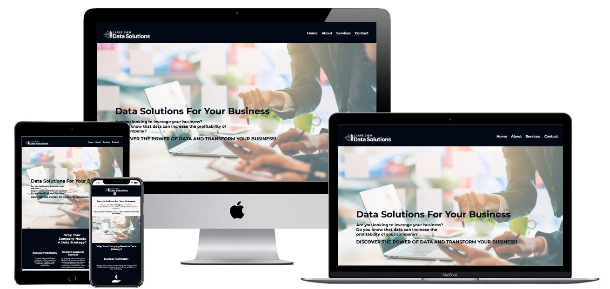

# **_Carpe Diem Data Solutions - Project Portfolio 1 - HTML & CSS_**

 

Carpe Diem Data Solutions is a small business consulting company that offers data analysis, data science and data engineering services. Our target audience through this website
 are small and medium -sized companies that want to improve their performance, profitability and customer services through their data.

Welcome to the live site here: <a href="https://fmstacco.github.io/Carpe-Diem-Data-Solutions/index.html" target="_blank">Carpe Diem Data Solutions</a>

# Contents

* [**Objective**](<#objective>)
* [**User Experience UX**](<#user-experience-ux>)
    * [User Stories](<#user-stories>)
    * [Wireframes](<#wireframes>)
    * [Site Structure](<#site-structure>)
    * [Design Choices](<#design-choices>)
    *  [Typography](<#typography>)
    *  [Colour Scheme](<#colour-scheme>)
* [**Features**](<#features>)
    * [Navigation Menu](<#navigation-menu>)
    * [Home Page](<#home-page>)
    * [About Page](<#about-page>)
    * [Services Page](<#packages-page>)
    * [Contact Page](<#contact-page>)
    * [Footer](<#footer>)
    * [**Technologies Used**](<#technologies-used>)
* [**Testing**](<#testing>)
* [**Deployment**](<#deployment>)
* [**Credits**](<#credits>)
    * [**Content**](<#content>)
    * [**Media**](<#media>)
*  [**Acknowledgements**](<#acknowledgements>)

# Objective 

This project aims to deliver a professional site of a business consultancy focused on data analysis and data science, so that potential customers - small and medium -sized companies - know the services offered and the benefits they will have through our job.

# User Experience (UX)

## User Stories

* As a potential client, I want to easily navigate through their website pages so I can quickly get the information that I’m looking for.[navigation bars and buttons].
* As a potential client, I want to see what the results my company can achieve after contracting their services. [benefits].
* As a potential client, I want to see the people who are the people doing the job and its credentials, it would increase my confidence towards getting in touch and hiring them. [about us page]
* As a potential client, I want to know what services the company offers so I can quickly understand if they can address my business issues. [services page]
* As a potential client, I want to see how the company has helped other clients it helps me to see how competent they are doing their job. [testimonial]
* As a potential client, I want to know that they will get in touch quickly for a discussion on my business and how can they help me. [thank you page]
* As a potential client, I want to see what tools they use when offering their services so I can trust they know what they are doing. [tools]

[Back to top](<#contents>)

## Wireframes

The wireframes for Carpe Diem Data Solutions website were produced on [Balsamiq](https://balsamiq.com).  

 

[Back to top](<#contents>)

## Site Structure

Carpe Diem Data Solutions website has four pages. The [home page](index.html) is the default loading page, [about](about.html), [services](services.html.html) and [contact](contact.html) pages are all accessible from the navigation menu and from the footer menu. 

[Back to top](<#contents>)

## Design Choices

 * ### Typography
      The fonts chosen were 'Inter' for the headings and 'Roboto' for the body text. They fall back to cursive and sans-serif respectively. 
  

 * ### Colour Scheme

# Features

## Navigation

## Home Page

## About Page

## Services Page

## Contact Page

## Thank You Page

[Back to top](<#contents>)

